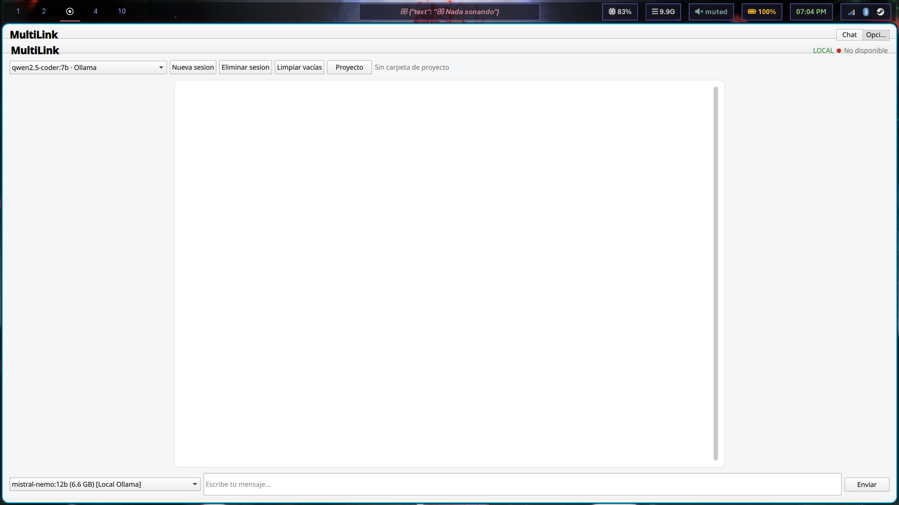
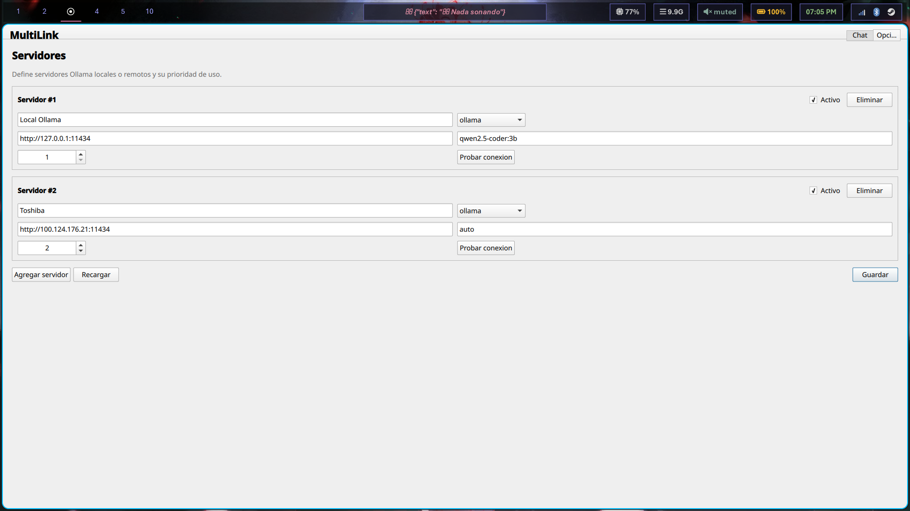
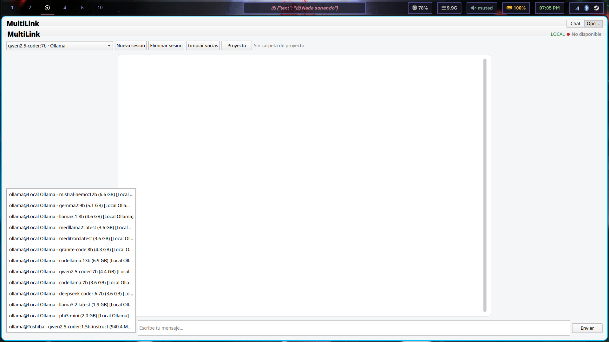

# MultiLink

[](https://opensource.org/licenses/MIT)
[](https://github.com/multilink-dev/multilink/actions)
[](https://rustup.rs/)
[](https://www.qt.io/)

MultiLink is a cross-platform desktop application for interacting with Large Language Models (LLMs). It uses a native Qt/QML GUI with a reusable Rust core focused on performance, stability, and clear architecture boundaries.

The next product direction is a local-first coding agent. The current codebase already includes context retrieval, a small deterministic tool registry, project initialization diagnostics, skills, LAN/MCP adapters, and an experimental LSP. It is not yet a full autonomous coding agent because safe patch editing, allowlisted command execution, validation loops, and live LSP integration still need to be completed. See `docs/CODING_AGENT_MVP.md` for the canonical implementation contract.

## 🚀 Getting Started

Follow these steps to get MultiLink up and running on your local machine.

### Prerequisites

Ensure you have the following installed:

*   **Rust**: A stable toolchain (install via [rustup](https://rustup.rs/)).
*   **CMake**: Version 3.21 or higher.
*   **Qt 6**: (6.5+ recommended) with `QML` and `Quick` modules.

### Platform-Specific Setup

#### Linux (e.g., Ubuntu 24.04+)
```bash
sudo apt update
sudo apt install -y qt6-base-dev qt6-declarative-dev cmake build-essential libgl1-mesa-dev libxkbcommon-dev
```

#### macOS
```bash
brew install qt cmake ninja
```

#### Windows
Install via [Chocolatey](https://chocolatey.org/):
```bash
choco install cmake ninja -y
# For Qt6, use the official online installer or 'install-qt-action' in CI/CD.
```

### Building and Running

From the repository root, execute the following commands to build MultiLink:

```bash
# Configure the build system (creates 'build' directory)
cmake -S gui -B build -DCMAKE_BUILD_TYPE=Release

# Compile the project
cmake --build build --config Release
```

The executable will be located in the `build/` directory (or `build/Release` on Windows). You can run it directly from there.

## 🌟 Features

*   **Cross-Platform Native UI**: Powered by Qt/QML for a fast and responsive desktop experience.
*   **Robust Rust Core**: Handles streaming, session state, persistence, cancellation, and provider routing with high performance and memory safety.
*   **Multiple LLM Providers**: Supports local providers like Ollama and is extensible for remote OAuth providers (e.g., Gemini, OpenAI Codex).
*   **Context Management**: Intelligent context builder with bounded token budgets and project-context injection.
*   **Encrypted Token Storage**: OAuth tokens are securely stored using AES-256-GCM encryption.
*   **Model Management**: Registry for local model detection, size tracking, migration, and deletion.
*   **Server Configuration UI**: Manage multiple Ollama servers from the Settings page and test connectivity directly from the app.
*   **Remote Diagnostics**: If a server test fails, MultiLink surfaces actionable hints (bind/firewall/network) instead of generic errors.
*   **Model-Aware Context Budgets**: Context budgets are adjusted dynamically using `/api/show` model metadata to improve small-model quality.
*   **Execution Metrics**: Runtime emits structured generation metrics (tokens, latency, top-k, fallback usage).
*   **Early Coding Agent Runtime**: Includes project context retrieval, read-only filesystem tools, `/init`, `/doctor`, explicit `/write-file`, skills discovery, and LAN/MCP scaffolding.

## ⚙️ Configuration (V2)

By default, MultiLink reads user config from:

- `~/.config/multilink/multilink.toml`

Current schema uses `version = 2` with `[[servers]]`:

```toml
version = 2

[[servers]]
name = "Local Ollama"
provider = "ollama"
base_url = "http://127.0.0.1:11434"
default_model = "qwen2.5-coder:3b"
priority = 1
enabled = true

[context]
embeddings_enabled = true
embed_model = "embeddinggemma"
project_top_k = 8
max_project_tokens = 2000
debug = false

[routing]
remote_threshold = "heavy"
```

Notes:

- Legacy V1 config is migrated automatically to V2.
- You can still override key values via environment variables for CI/dev workflows.
- `routing.remote_threshold` also supports `MULTILINK_REMOTE_THRESHOLD` (`auto|light|medium|heavy|critical`).
- For remote/LAN/Tailscale troubleshooting, see `docs/network-troubleshooting.md`.

## 🎨 Architecture

MultiLink's architecture is designed for clarity, maintainability, and performance:

```text
GUI (Qt/QML)
  -> Qt Shim (C++ QObject adapter for Rust FFI, minimal business logic)
    -> Rust Backend (Static Library via FFI)
      -> Core (Rust)
        -> modules: providers/, auth/, model_manager/, system/, config/
```

### Simplified Runtime Flow

1.  **QML Action**: User interaction in the GUI triggers a signal.
2.  **ChatController Shim**: The C++ shim (`gui/src/chatcontroller.*`) translates the QML signal into a Rust FFI call.
3.  **Rust Backend**: The Rust core processes the request (e.g., interacts with an LLM provider).
4.  **Provider Stream**: LLM responses are streamed back.
5.  **ChatRuntime**: Rust runtime throttles/persists stream events.
6.  **Rust Callbacks**: Processed data is sent back via Rust callbacks.
7.  **Qt Signals**: The C++ shim converts Rust callbacks into Qt signals.
8.  **QML Render**: The GUI updates in real-time.

For a detailed design overview, refer to `docs/architecture.md`.

## ⚙️ Development

### Engineering Principles

*   **Performance and Correctness First**: Prioritized over immediate interface polish.
*   **Rust Core as Backbone**: Core logic for streaming, memory, and context handling resides in Rust.
*   **Declarative QML**: UI layers focus on rendering state and dispatching user intent, without networking or disk logic.
*   **Thin Qt Shim**: Minimizes C++ adapter logic, focusing solely on data adaptation between Rust FFI and Qt properties/signals.

### Project Layout

```text
.
├── core/             # Core Rust backend logic, LLM integrations, auth, config
│   ├── src/
│   │   ├── commands/     # Slash commands: /init, /doctor, /write-file
│   │   ├── context_engine/# Retrieval, indexing, chunking, embeddings
│   │   ├── orchestrator/ # Planner/executor for tool + LLM workflows
│   │   ├── tools/        # Deterministic internal tools
│   │   ├── providers/    # Integrations with various LLM providers (Ollama, Gemini, etc.)
│   │   ├── auth/         # Authentication mechanisms (OAuth, token storage)
│   │   ├── model_manager/# Local LLM model discovery and management
│   │   ├── system/       # System-level utilities and platform interactions
│   │   └── config/       # Configuration handling
│   └── tests/        # Unit and integration tests for the Rust core
├── gui/              # Qt/QML graphical user interface
│   ├── qml/          # QML files defining the UI
│   ├── src/          # C++ source for the Qt shim and main application
│   └── assets/       # Static assets like images and screenshots
├── lsp-server/       # Experimental semantic LSP server
├── docs/             # Project documentation (architecture, roadmap, etc.)
├── tests/            # High-level project tests (e.g., end-to-end if implemented)
└── config/           # Default configuration files
```

### Running Tests

To ensure code quality and correctness, run the tests:

*   **Rust Core Tests**: Navigate to the `core/` directory and run:
    ```bash
    cargo test
    ```
*   **Rust GUI Backend Tests**: Navigate to `gui/rust/chat_controller/` and run:
    ```bash
    cargo test
    ```

*(Note: Ensure you have `cargo` installed via `rustup`.)*

## 🔒 Security Considerations

*   **Encrypted Data at Rest**: OAuth tokens are encrypted using AES-256-GCM.
*   **Restrictive Permissions**: Configuration and token files are saved with appropriate, restrictive file permissions on Unix-like systems.
*   **Consent-Gated Operations**: No privileged installation commands are executed without explicit user consent.
*   **Separation of Concerns**: OAuth logic and secret handling are strictly confined to Rust modules; QML never directly handles sensitive information.
*   **Future Enhancements**: Planned integration with system keyrings and PKCE hardening.

## ⚡ Performance Optimizations

*   **Real-time UI Updates**: Achieved through efficient streaming of UI events.
*   **Throttled Persistence**: During LLM response streaming, data persistence is throttled (e.g., every 400ms) to reduce CPU and disk I/O, with a guaranteed flush on stream completion or error.
*   **Non-blocking Cancellation**: Streaming operations can be explicitly and non-blockingly cancelled via runtime-owned handles.
*   **Context Limits**: LLM context windows are intentionally capped below provider maximums to enhance request resilience, especially with large payloads.

## 🖼️ Screenshots

| | |
|---|---|
| **Main Chat** | **Servers** |
|  |  |
| **Sessions & Models** | |
|  | |
